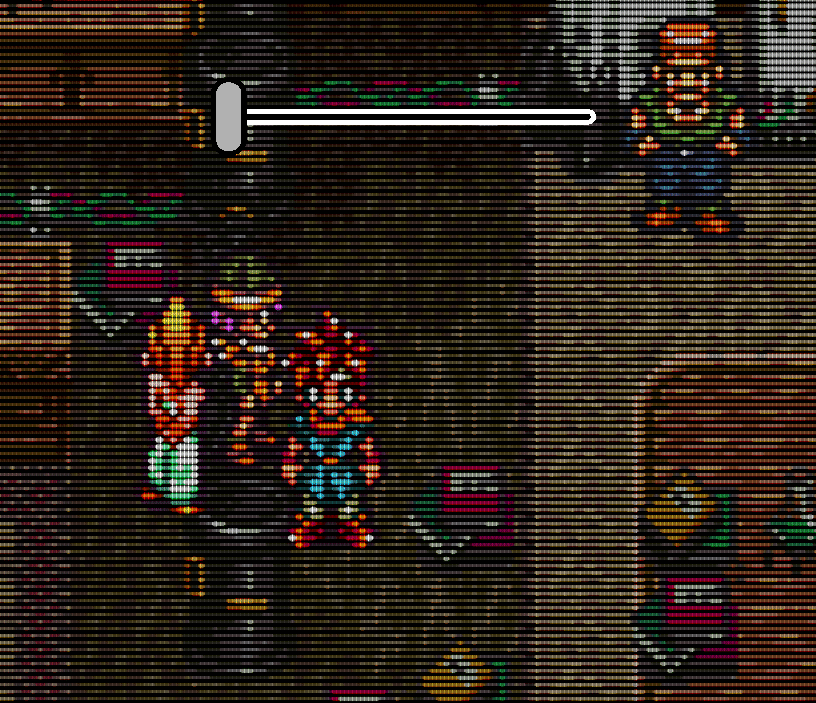
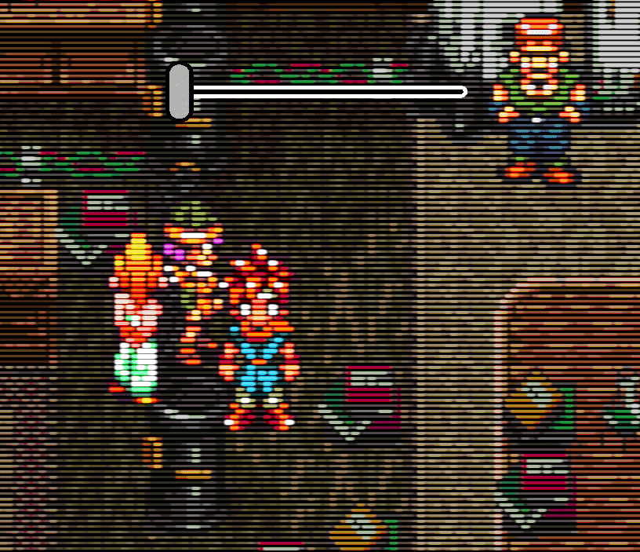

Scanline shader for RetroArch.

# Motivation
The motivation for this shader comes from when I tried a native 240p @ 120 Hz resolution on my PC CRT.
The black gaps were way too thick!

Instead of showing the native resolution 240p picture, I wanted to send high-quality and configurable scanlines to the CRT monitor.
This would give me all other effects like blooming, shadow masks, etc., for free!

# Goals
The purpose of this shader is to render painterly, high-resolution scanlines, as if drawn with a perfectly uniform airbrush.

It should be intuitive and easy to configure while still allowing reasonable control over the final look.

The implementation follows what is aesthetically pleasing, not what is physically accurate.

## What it won't do
The goal of this shader is not to replace shaders that fully simulate CRT displays like CRT-royale or other similar shaders.

As such, there are no plans to add curvature, vignetting, halation, etc., effects.

# How to install and use
Download or clone this repository. The latest stable release can be downloaded on the [releases](https://github.com/fishcu/sgs-shader/releases) page.

In RetroArch, when a core is running, go to the Quick Menu (standard hotkey: F1), Shaders -> Load Shader Preset.
Load any of the available presets.

**Note**: Slang shaders such as this one will only show up with the `vulkan`, `glcore`, and `d3d12` video drivers.
If you are using the `gl` driver, which is the default on Linux distributions, make sure to switch to the `vulkan` or `glcore` drivers!

If you like to run the shader by default when opening the core, you can set it permanently by going to the Quick Menu -> Shaders -> Save Core Preset.

## Presets explained
The following presets are available:
- `sgs_DEFAULT`: The default preset. Optimized for 240p resolution content on 4k displays. However, it will also work for other input and output resolutions ("freescale" behavior).
- `sgs_DEFAULT_MASK`: Same as the default preset, but enables an aperture grille mask effect.
- `sgs_force_*`: These presets sample the input at a fixed resolution according to the file name. This can be used with higher resolution content to achieve a lower resolution look with emphasized scanlines.
- `sgs_potato_pc` & `sgs_potato_pc_mask`: Same as the default presets with and without the mask effect, but optimized for low-end hardware. This should be used if the default presets run too slow on your computer. Many of the features in the default preset will not be available with the potato preset, or will have no effect if changed in the settings.

## Ensuring sharp scaling
On Windows, make sure to set the display scaling under display settings -> "Scale and layout" to 100%. Using custom settings such as 125% or 175% may cause scaling artifacts with RetroArch.

In RetroArch, make sure to have the following parameters set in the video settings for the best video quality:
- Settings -> Video -> Scaling -> Integer Scale ON
- Settings -> Video -> Scaling -> Aspect Ratio Custom. Then, scale up the "Custom Aspect Ratio (Height)" to fill your screen (e.g., 9x for 240p content on a 4k display). Then, scale up the "Custom Aspect Ratio (Width)" to match the height and to achieve a proper aspect ratio. For example, the SNES has an aspect ratio of 8:7. If choosing a 9x vertical resolution of 2016 for SNES content, the horizontal resolution should be 2016 * 8 / 7 = 2304.

## What to do if performance is slow
Despite some optimization efforts, the shader is quite heavy for higher-resolution content. It runs well for 480p and lower resolution content on a laptop GTX 1060.
However, it might still be too heavy in certain scenarios. You can do the following to increase performance, in decreasing order of impact:

- Switch to the "potato PC" preset. This will render at 5 times the input resolution instead of the default 9x. It will also disable scanline bleeding by default. This runs at several thousand FPS even for higher-resolution content on my laptop GTX 1060.
- Turn off scanline bleeding. This drastically reduces the number of samples required for each pixel and thus improves performance.
- Any setting that decreases the spot size will increase the performance: Increase hardness, decrease thicknesses, or decrease wideness.

# Settings overview
These settings can be changed in the menu at Shaders -> Shader Parameters after loading a preset.

Most settings can be changed smoothly in the given range. For these settings, animations are shown where the slider overlay shows the current value of the setting in question. 

| **Setting name**   | Description | **Low vs. high setting**|
|--------------------|--------------------------------------|----------------|
| _Shader disabled_  | Input images.                        | |
| **Scanline settings** |                                   |                |
| Min. thickness     | How thick dark parts are rendered.   |  |
| Max. thickness     | How thick bright parts are rendered. |  |
| Hardness           | How hard the contour of the spot is. | |
| Spot gamma         | Controls spot thickness's tendency  towards thinner or thicker sizes. |  |
| Wideness           | Aspect ratio of the beam.            |  |
| Scanline center    | Sub-pixel alignment of the scanline.  This can control scanline sharpness  when rendering at lower resolutions. |   |
| Scanline bleeding  | Allows scanlines to bleed into each  other. Necessary for softer spots  to be rendered correctly. Turning  off provides a performance boost. | Off:  On:  |
| **Mask settings**  |                                      |                |
| Mask strength      | Strength of the applied mask.        |  |
| Mask fineness      | How coarse or fine the pattern is.   |  |
| Mask brightness    | Controls percentage of lit pixels.   |  |
| **Image processing settings** |                                |                |
| Erode width        | Horizontally widens darker areas.  Can be used to achieve equal width  of bright and dark pixels.  This is for example important  for text readability. |  |
| Blur width         | Strength of horizontal blur.         |  |
| Overshoot strength | Overshoot & sharpening strength.  Allows the spot size to go beyond  the maximum thickness momentarily  at the start of a bright part of  the scanline.    |  |
| **Color settings** |                                      |                |
| Black point        | Output brightness of black input.    |   |
| Output gamma       | Output gamma correction.             |  |
| **RCA Sharpening settings** |                             |                |
| RCAS strength      | Strength of sharpening applied.      |  |
| RCAS denoise       | Enable RCAS noise suppression.  It's recommended to leave this on  to avoid artifacts. |   |

# Full-size screenshots
All of these screenshots use default shader parameters.

# Photos
These have been photographed off of my own CRT. 

